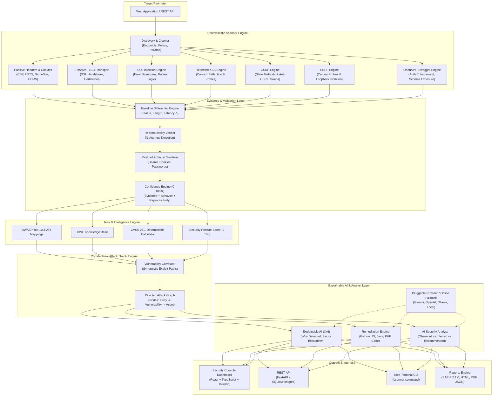

# AEGIS AI-Vuln-Scanner (v2.0)

> **Evidence-Grounded, Explainable AI Web & API Vulnerability Assessment Platform**  
> *Deterministic Source-of-Truth Detection • Structured Evidence Capture • Multi-Stage False Positive Filtering • Risk Scoring • Attack Path Graphing • Pluggable AI Security Analyst*

---

## 1. Overview & Vision

**AEGIS AI-Vuln-Scanner** is a next-generation security assessment platform that eliminates hallucinations and shallow heuristic wrappers by establishing a strict architectural principle:

$$\text{Detection} \longrightarrow \text{Evidence} \longrightarrow \text{Validation} \longrightarrow \text{Confidence} \longrightarrow \text{Explainable AI} \longrightarrow \text{Risk Scoring} \longrightarrow \text{Correlation} \longrightarrow \text{Attack Graph}$$

* **Deterministic Engine is Truth**: The scanner probes targets using controlled HTTP verification rules, measuring baseline differentials, error signatures, latency variance, and reproduction counts.
* **Explainable AI (XAI)**: The AI layer interprets, correlates, and explains verified evidence—it never invents findings.
* **Actionable Remediation**: Produces defensive code snippets for Python, Node.js/JavaScript, Java, and PHP with verification procedures.
* **Full Offline Fallback**: Functions 100% autonomously without external LLM keys or network access, providing deterministic rule-based explainability and remediation.

---

## 2. Platform Architecture



---

## 3. Core Features

### Modular Deterministic Detection Engine
* **SQL Injection**: Multi-dialect error signature matching (MySQL, PostgreSQL, SQLite, MSSQL, Oracle), boolean-differential verification, and reproduction checks.
* **Reflected XSS**: Context-aware HTML body and attribute quote reflection with benign probes.
* **CSRF**: Form method inspection (POST/PUT/DELETE), token verification, and cookie `SameSite` attribute audit.
* **SSRF**: Canary and metadata IP probe analysis with strict scanner-side boundary protections.
* **Security Headers & Cookies**: Passive evaluation of CSP, HSTS, X-Frame-Options, X-Content-Type-Options, Referrer-Policy, Permissions-Policy, cookie flags (`HttpOnly`, `Secure`, `SameSite`), and CORS policies.
* **Passive TLS**: SSL/TLS version negotiation, certificate checks, and cleartext HTTPS redirection enforcement.
* **OpenAPI / Swagger 2.0 & 3.0+**: Automated parsing of definitions to detect missing authentication on sensitive endpoints and excessive data exposure in response schemas.

### Structured Evidence Engine
Every finding captures auditable deterministic proof:
```json
{
  "finding_id": "SQLI-001",
  "type": "SQL Injection",
  "target": "/products",
  "parameter": "id",
  "method": "GET",
  "evidence": {
    "baseline_response_length": 1421,
    "test_response_length": 3742,
    "status_code_changed": true,
    "response_time_changed": false,
    "error_signature": "mysql (You have an error in your SQL syntax)",
    "payloads_tested": 4,
    "successful_payloads": 1,
    "reproducible": true,
    "reproduction_count": 3
  }
}
```
* **Redaction by Default**: Authorization tokens, bearer keys, cookies, passwords, and sensitive params are automatically redacted from stored requests and responses.

### Explainable AI & Confidence Engine
* **Deterministic Confidence Calculation (0–100%)**:
  $$\text{Confidence} = (\text{Evidence} \times 0.35) + (\text{Behavior} \times 0.25) + (\text{Reproducibility} \times 0.25) + (\text{Detector Reliability} \times 0.15)$$
* **Validation Status**: `Confirmed` ($\ge 90\%$), `Likely` ($\ge 75\%$), `Suspicious` ($\ge 55\%$), `Potential False Positive` ($< 55\%$).
* **Auditable Explainability**: Breaks down *Why Detected*, *Evidence Summary*, *Detection Logic*, *Confidence Factors*, *Observed Behavior*, and *Impact Assessment*. No opaque chain-of-thought.

### Vulnerability Correlation & Directed Attack Graph
* **Correlation Engine**: Detects synergistic multi-vulnerability exposure chains (e.g. *XSS + Missing HttpOnly + Missing CSP* = Browser Session Hijack; *SSRF + Internal API* = Network Pivot).
* **Interactive Attack Graph**: Traces threat progression:
  $$\text{Internet Attacker} \longrightarrow \text{Web Application} \longrightarrow \text{Endpoint} \longrightarrow \text{Parameter Vector} \longrightarrow \text{Vulnerability} \longrightarrow \text{Compromised Asset}$$

### Conversational AI Security Analyst
Interactive security advisor that respects strict evidence grounding. Responses are partitioned into:
* `[OBSERVED]`: Verified deterministic facts from scan evidence.
* `[INFERRED]`: Analytical deductions based on threat modeling.
* `[RECOMMENDED]`: Actionable architectural & code remediation.

---

## 4. Scan Profiles

| Profile | Included Modules | Description |
| :--- | :--- | :--- |
| `quick` | Discovery, Headers, TLS | Fast passive perimeter inspection |
| `standard` | Quick + SQLi + XSS + CSRF + SSRF | Default balanced web vulnerability assessment |
| `deep` | Standard + Discovery + Parameter analysis + Behavioral validation + Attack path | Thorough multi-payload behavioral audit |
| `passive` | Headers, Cookies, TLS | Safe for non-intrusive compliance auditing |
| `api` | Discovery, OpenAPI/Swagger Analysis | Audits REST schemas, auth rules, and data exposure |
| `full` | All modules combined | Complete comprehensive security assessment |

---

## 5. Installation & Setup

### Prerequisites
* Python 3.10+ (tested through Python 3.14)
* Node.js 18+ and npm (for frontend dashboard development)

### 1. Clone Repository & Setup Virtualenv
```bash
git clone https://github.com/4xyy/AI-Vuln-Scanner.git
cd AI-Vuln-Scanner

python3 -m venv .venv
source .venv/bin/activate  # On Windows: .venv\Scripts\activate
pip install -r requirements.txt
```

### 2. Configure Environment
```bash
cp .env.example .env
```
*(Optional)* Add an AI Provider in `.env`:
```env
AI_PROVIDER=gemini  # or openai, ollama, local, none
AI_API_KEY=your_api_key_here
AI_MODEL=gemini-1.5-flash
```
*Note: If no key is configured, the application functions autonomously using the offline deterministic reasoning engine.*

### 3. Build Web Console Frontend
```bash
cd frontend
npm install
npm run build
cd ..
```

---

## 6. Running the Platform

### Option A: Complete Web Platform (Backend + Frontend Console)
```bash
uvicorn backend.main:app --host 0.0.0.0 --port 8000 --reload
```
Navigate to **http://localhost:8000** in your browser to access the Security Console Dashboard.

### Option B: Terminal CLI
The platform provides a first-class CLI:
```bash
# Execute standard scan
python -m backend.cli scan --target http://localhost:8000 --profile standard

# Export SARIF for CI/CD
python -m backend.cli scan --target http://localhost:8000 --format sarif --output results.sarif

# Export HTML report
python -m backend.cli scan --target http://localhost:8000 --format html --output report.html

# Export Executive PDF report
python -m backend.cli scan --target http://localhost:8000 --format pdf --output report.pdf

# List historical scans
python -m backend.cli list

# Compare two scans
python -m backend.cli compare SCAN-001 SCAN-002
```

### Option C: Backward-Compatible Interactive Entrypoint
```bash
python vuln_scanner.py
```

### Option D: Docker Deployment
```bash
docker-compose up --build -d
```

---

## 7. REST API Reference

| Method | Endpoint | Description |
| :--- | :--- | :--- |
| `POST` | `/api/scans` | Launch new scan with target URL and profile |
| `GET` | `/api/scans` | List historical and active scans |
| `GET` | `/api/scans/{id}` | Get full scan status, progress, and findings |
| `POST` | `/api/scans/{id}/cancel` | Abort a running scan |
| `GET` | `/api/scans/{id}/findings` | Filter findings by severity and confidence |
| `GET` | `/api/findings/{id}` | Inspect individual finding with full evidence |
| `GET` | `/api/scans/{id}/attack-paths` | Retrieve directed attack graph JSON |
| `GET` | `/api/scans/{id}/correlations` | Retrieve correlated vulnerability clusters |
| `GET` | `/api/scans/{id}/report` | Download report (`format=sarif\|html\|pdf\|json`) |
| `GET` | `/api/scans/compare` | Compare two scan IDs (`?scan_a=...&scan_b=...`) |
| `POST` | `/api/scans/openapi` | Audit OpenAPI / Swagger JSON/YAML spec |
| `POST` | `/api/ai/analyze` | Inquire with the AI Security Analyst |
| `POST` | `/api/ai/explain` | Generate XAI explanation for a finding |
| `POST` | `/api/ai/remediate` | Generate multi-language remediation blueprint |

---

## 8. CI/CD & SARIF Integration

AEGIS generates OASIS SARIF 2.1.0 output natively.

### GitHub Actions Example:
```yaml
name: Security Scan
on: [push, pull_request]

jobs:
  security-audit:
    runs-on: ubuntu-latest
    steps:
      - uses: actions/checkout@v4
      - uses: actions/setup-python@v5
        with:
          python-version: '3.11'

      - name: Install Dependencies
        run: pip install -r requirements.txt

      - name: Run AEGIS Scanner
        run: |
          python -m backend.cli scan \
            --target http://staging.internal:8000 \
            --profile standard \
            --format sarif \
            --output results.sarif

      - name: Upload SARIF to GitHub Security Tab
        uses: github/codeql-action/upload-sarif@v3
        with:
          sarif_file: results.sarif
```

---

## 9. Running Tests

The test suite covers unit tests, integration tests against local mock fixtures, evidence sanitization, confidence scoring, attack graph synthesis, report exporters, and FastAPI routes:
```bash
pytest tests/ -v
```
All 24 automated tests run in-process with 0 external network dependencies.

---

## 10. Responsible Use Policy

AEGIS AI-Vuln-Scanner is designed strictly for authorized defensive auditing, developer education, security posture evaluation, and testing of user-owned or staging infrastructure.

* Do **NOT** use this software against targets without prior written authorization.
* The software intentionally implements safe verification probes and does not generate weaponized exploit code.
